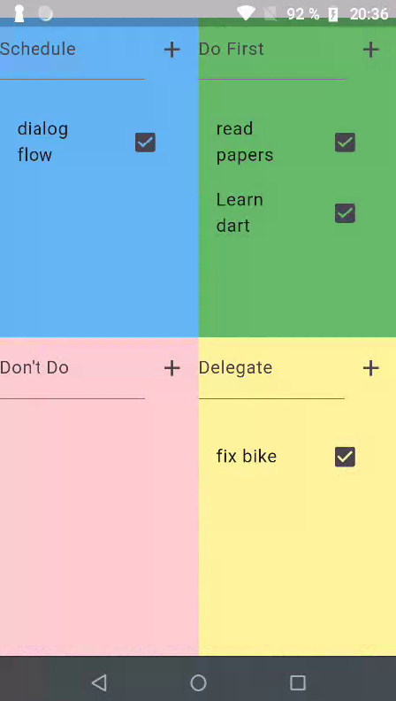

# Eisenshower to-do

The project aims to boost your productivity.



## For building the app
```
flutter build apk --release
```
The location will be:
`\eisenshower_todo\build\app\outputs\flutter-apk\app-debug.apk`

## For signing the app
<!-- ```
keytool -genkey -v -keystore <PATH_TO_SAVE>\my-release-key.jks -keyalg RSA -keysize 2048 -validity 10000 -alias my-key-alias
``` -->

## Libs used from pub.dev

1. [Shared Preferences](https://pub.dev/packages/shared_preferences)
In case you don't want to use Firebase, the suggestion is to use:
```
flutter pub add shared_preferences
```
2. [Generate iPA file]([LINK](https://www.youtube.com/watch?v=mQMy12Sk0xM&list=LL&index=13))
3. [Scarlet](https://www.youtube.com/watch?v=aKPYaSI8d3Q)
4. [Firebase](https://firebase.google.com/)
```
flutter pub add firebase_core
flutter pub add cloud_firestore
```
<!-- 5. [TEXT](LINK) -->